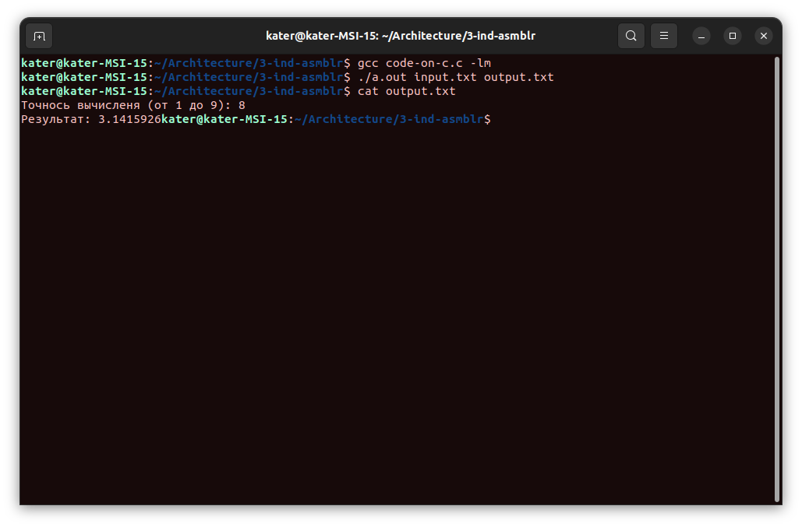
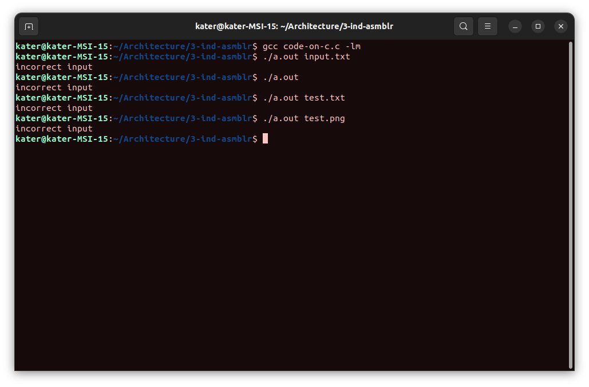
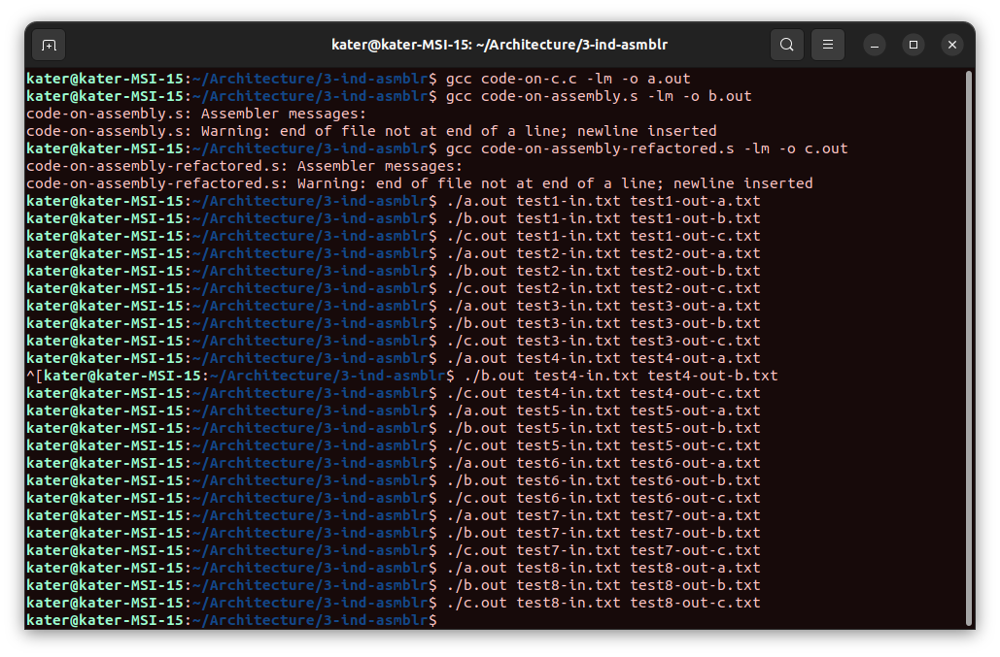

# Архитектура вычислительных систем. ИДЗ №3.

### Вариант 22. Разработать программу вычисления числа π с точностью не хуже 0,1% посредством дзета-функции Римана.

#### Выполнил Старцев Евгений, БПИ219.

---

### ВАЖНО!

Так как в программе используется библиотека `math.h`, компилировать программы на C и ассемблере необходимо с
флагом `-lm`:

```
gcc code-on-c.c -lm
```

## Решение на 7 баллов.

- ### Исходные данные и формируемые результаты должны вводиться и выводиться через файлы. Имена файлов задаются с использованием аргументов командной строки. Ввод данных в программу с клавиатуры и вывод их на дисплей не нужен. За исключением сообщений об ошибках - `выполнено`

Пример работы программы на фотографиях ниже.

Корректная работа программы:


P.S. точность вычисления от 1 включительно до 9 невключительно.

- ### Командная строка проверяется на корректность числа аргументов. В программе должна присутствовать проверка на корректное открытие файлов. При наличии ошибок должны выводиться соответствующие сообщения - `выполнено`

Работа программы в случае отсутствия одного из названий файлов (то есть, проверка на корректность числа аргументов):


Проверка на корректное открытие файлов находится в файле [code-on-c.c](code-on-c.c):

```c
FILE *input = fopen(argv[1], "r");
FILE *out = fopen(argv[2], "w");
if ((input == NULL) || (out == NULL)) {
    printf("Incorrect file!\n");
    return 0;
}
```

При наличии ошибок выводятся сообщения. Более подробно - в файле с кодом на С.

- ### Реализация программы на ассемблере в виде двух или более единиц компиляции (программу на языке C, реализующую новый функционал, разделять допускается, но не обязательно). Сформированная модульная ассемблерная программа должна быть модифицирована в соответствии с выше предъявляемыми требованиями. В нее также должны быть внесены соответствующие комментарии - `выполено`

Файлы с разделённой программой на ассемблере находятся в файлах [code-on-assembly-1.s](code-on-assembly-1.s)
и [code-on-assembly-2.s](code-on-assembly-2.s). Все необходимые комментарии добавлены. Разделил программу на С на два
файла (по методам) и скомпилировал каждый из них в ассемблерную программу, после чего получил два ассемблерных файла.

- ### Необходимо подготовить нескольких файлов с данными, обеспечивающих тестовое покрытие разработанной программы - `выполено`

Все тестовые файлы находятся в папке `tests`. Так как программа делалась на 7 баллов, я сразу сделал и файлы с тестами (
файлы вида `test1-in.txt`), и файлы с результатами тестов на трёх программах (файлы вида `test1-out-a.txt`)

- ### Для сопоставления с полученной ассемблерной программой необходимо также приложить исходные тексты на ассемблере, сформированные компилятором языка C (их число определяется количеством единиц компиляции в программе на языке C) - `выполнено`

Все исходные тексты на ассемблере приложены.

- ### Отображение в отчете информации о проведенном функциональном расширении, формате входных файлов, формате командной строки и результатах работы с тестовыми файлами - `выполнено`

Отчёт вы читаете прямо сейчас :) Про тестовые файлы будет описано чуть ниже.

## Элементы решения на 4, 5, 6 баллов

- ### Рефакторинг программы на ассемблере (6) - `выполнено`

Рефакторинг программы на ассемблере выполнен. Результат - в
файле [code-on-assembly-refactored.s](code-on-assembly-refactored.s).

- ### Сопоставление размеров программы на ассемблере, полученной после компиляции с языка C с модифицированной программой, использующей регистры. Сопоставление программ необходимо проводить на уровне объектных и бинарных файлов. Исходные тексты ассемблерных программ сравнивать вряд ли имеет смысл из-за наличия в модифицированной программе комментариев. (6) - `выполнено`

Размеры соответствующих программ на ассемблере:

[code-on-assembly.s](code-on-assembly.s) (программа, скомпилированная с отладочными опциями): 5067 bytes, 264 lines

`code-on-assembly-refactored.s` (программа после рефакторинга): 4951 bytes, 276 lines

Возможно, сравнение не совсем корректное, так как в обоих программах есть комментарии. Тем не менее, их примерно
одинаковое количество, а в программе после рефакторинга строк больше, но размер меньше.

- ### В программе на языке C необходимо использовать функции с передачей данных через формальные параметры (5) - `выполено`

Смотрите файл с кодом на C.

- ### Представление результатов тестовых прогонов для разработанной программы. Оценка корректности ее выполнения на основе сравнения тестовых прогонов результатами тестирования программы, разработанной на языке C (6) - `выполнено`

Файлы с тестами - в папке `tests`. Так как изначально разрабатывал программу на 7 баллов, все тесты хранятся в файлах,
поэтому скриншоты с наглядным доказательством того, что программы работают одинаково не получится. Поэтому приложу
скриншот, подтверждающий тестовый прогон на трёх программах.



- ### КОММЕНТАРИИ

Во всех файлах с кодом на ассемблере были добавлены необходимые комментарии.

- ### Из ассемблерной программы убраны лишние макросы за счет использования при компиляции из C соответствующих аргументов командной строки и/или за счет ручного редактирования исходного текста ассемблерной программы (4) - `выполнено`

Была применена следующая команда:

```
gcc -masm=intel -fno-asynchronous-unwind-tables -fno-jump-tables -fno-stack-protector -fno-exceptions -S code-on-c.c
```

## Небольшой вывод.

Надеюсь, никакие требования на оценки 4/5/6, которые необходимо было проделать для получения оценки 7, не забыл. Были
договоренности о том, что можно делать ИДЗ сразу на желаемую оценку. Поэтому постарался сделать не только на 7 баллов,
но и какие-то основные требования на другие оценки, которые по крайней мере не пересекаются с требованиями на более
высокие оценки.